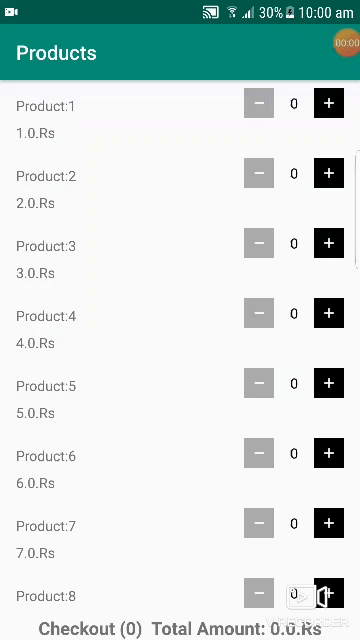

# ShoppingCart

Shopping cart is Kotlin android library that provide you cart managment feature. This library use coroutine to make cart management fast.



### Installation

``` implementation 'de.starkling.shoppingcart:shoppingcart:1.0.0' ```

### Usage

First you need to make your existing model class a Saleable type by implementing the [`Saleable`](https://github.com/zabi90/ShoppingCart/blob/master/shoppingcart/src/main/java/de/starkling/shoppingcart/models/Saleable.kt) Interface. We have Product in our sample app.

```
data class Product(var id:String, var name:String ... ) : Saleable 
```
and override the methods that Saleable provides you.

```
    override var itemQuantity: Int
        get()
      
    override fun getId(): String {
       return id // This will be the id of your product class
    }

    override fun getName(): String {
       return name // name of your class
    }

    override fun getPrice(): Float {
       return price // price of your product
    }

    override fun getQuantity(): Int {
        return itemQuantity // simply return override field
    }

    override fun getTotal(): Float {
        return itemQuantity * price // calculate total of cart item
    }
```


Then you need to access the CartManager instance by following line

```
val cartManager =  CartManager.getInstance(applicationContext)
```
Add Product into Cart by following line

```val product = Product("1","Egg",15)
  product.itemQuantity = 1 // product quantity need to be hold in cart 
  
  CoroutineScope(Dispatchers.Main).launch {
            cart.updateItem(item)
  }
```
You can get the total items count and price by following line via LiveData Observer

```
 cart.subscribeCartTotal().observe(this, Observer {
      totalTextView.text = "Checkout (${it.totalItems})  Total Amount: ${it.totalAmount}.Rs"
 })

```

We also provide function that take your existing products or items list come from api or an other source and map with existing cart item quantity.

```
 CoroutineScope(Dispatchers.Main).launch {
    val products = cart.mapWithCart(products)
 }        
```

Also you can remove item from cart use following method
```
cart.removeItem(product)
```

You can get the list of cart items from CartManager to show your cart items in recyclerView or for later use by following method

```
cart.getCartItems()
```
### Counter Widget
Library contain simple counter widget that usually used while adding item in cart. This widget only maintain count value.


Add following xml in your layout
```
    <de.starkling.shoppingcart.widget.CounterView
        android:id="@+id/counterView"
        android:layout_width="wrap_content"
        android:layout_height="wrap_content"
   />
   
```
Add listener to get counter updated value

```
    counterView.addCounterValueChangeListener(object :CounterView.CounterValueChangeListener{
         override fun onValueDelete(count: Int) {
                    //when value removed
                }

                override fun onValueAdd(count: Int) {
                    //when value added
                }
               
         })
```            
For more help and detail please checkout sample project. 

License
----

Apache License
